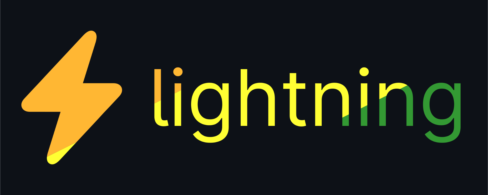

# @jersey/lightning

lightning is a typescript-based chatbot that supports bridging multiple chat
apps via plugins

## [docs](https://williamhorning.eu.org/lightning)

## example config

```ts
import { discord_plugin } from 'jsr:@jersey/lightning-plugin-discord@0.8.0';
import { revolt_plugin } from 'jsr:@jersey/lightning-plugin-revolt@0.8.0';

export default {
	prefix: '!',
	database: {
		type: 'postgres',
		config: {
			user: 'server',
			database: 'lightning',
			hostname: 'postgres',
			port: 5432,
			host_type: 'tcp',
		},
	},
	plugins: [
		discord_plugin.new({
			token: 'your_token',
			application_id: 'your_application_id',
			slash_commands: true,
		}),
		revolt_plugin.new({
			token: 'your_token',
			user_id: 'your_bot_user_id',
		}),
	],
};
```
